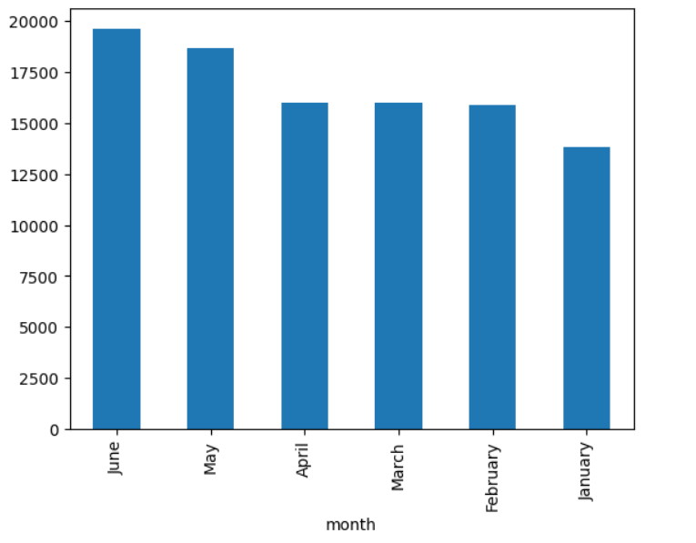
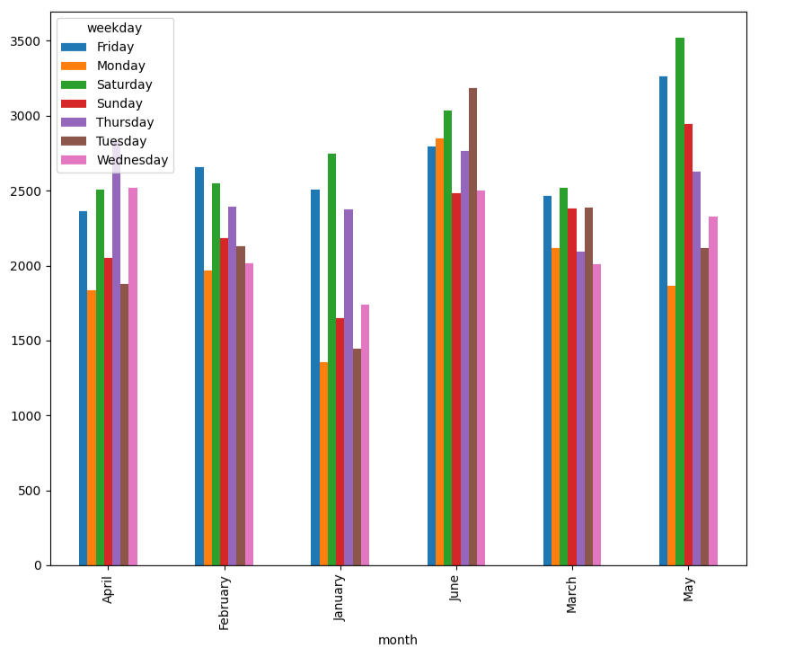
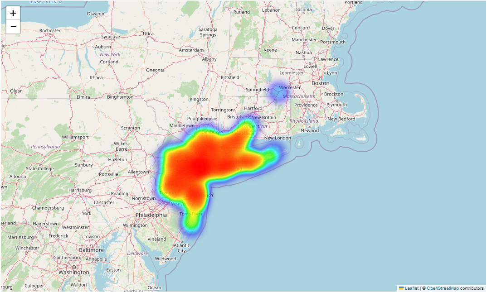
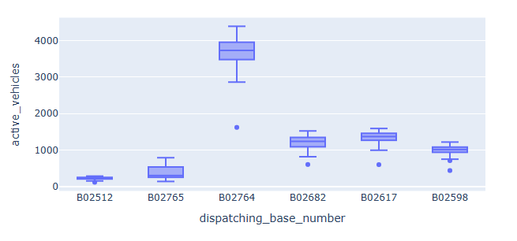

# 🚖 Uber Pickups Analysis in New York City

## 📌 Project Overview
This project explores Uber pickup patterns in New York City using Python and Jupyter Notebook.  
The goal is to identify trends in demand across time and location, and to uncover insights that could help improve ride availability and resource allocation.

---

## 🗂 Dataset
- Source: Uber Dataset (NYC)  
- Data contains Uber pickup information (date, time, and base number).

---

## 🎯 Analysis Questions
The notebook answers the following key questions:
1. **Which month has the maximum Uber pickups?**  
2. **What are the hourly rush hours in New York?**  
3. **Which Uber base number is the most active?**  
4. **Perform Spatial Analysis** to find pickup hotspots across NYC.  
5. **Perform Pairwise Analysis** to discover combinations of time/location leading to high demand.  

---

## 🛠 Tools & Libraries
- Python  
- Jupyter Notebook  
- pandas, numpy  
- matplotlib, seaborn
- HeatMap
- folium (for spatial visualization)  

---

## 📊 Results & Insights
Here are some highlights from the analysis (see diagrams in the `images/` folder):  

- **Monthly Trends:** Pickup demand peaks in **September**.  
- **Hourly Trends:** Rush hours are mainly **8–9 AM** and **5–6 PM**.  
- **Base Number Activity:** Base `B02512` recorded the highest number of pickups.  
- **Spatial Analysis:** Manhattan shows the densest pickup hotspots.  
- **Pairwise Analysis:** Evening hours + Manhattan locations create the highest surge.  

---

## 📸 Visualizations
Some sample charts from the analysis:

| Monthly Pickups | Hourly Trends |
|-----------------|---------------|
|  |  |  | 


---

## ▶️ How to Run
1. Clone this repository:
   ```bash
   git clone https://github.com/MohammadAbdelqader/Uber_Analysis_Practice.git
   cd Uber_Analysis_Practice
